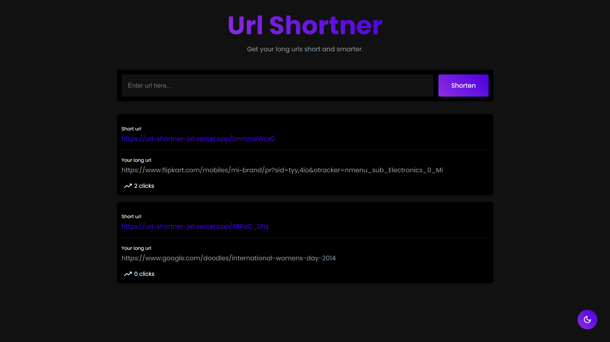
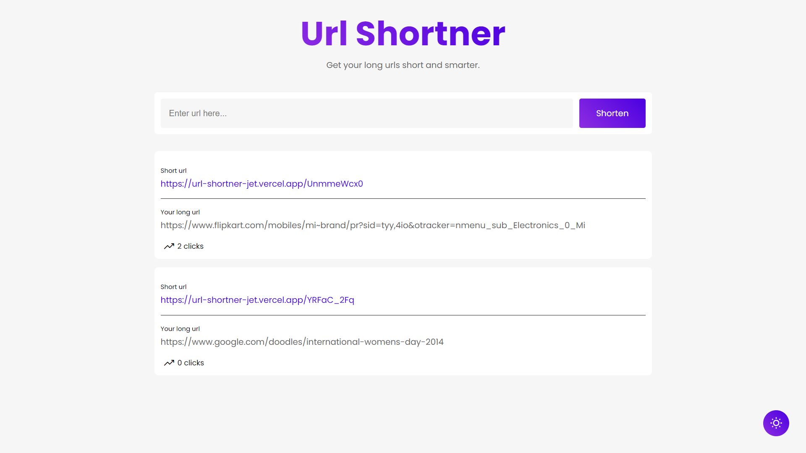

# Url Shortner Application

### Introdution
A web project built with ```React.js``` ```Node.js``` ```Express.js``` ```MongoDB```

- Url Shortner is a web application built using MERN Stack 
- The main purpose of the app. is that it takes any long url as an input and converts it into a short url which will be an alias for your long url.
- All the urls you created are store in MongoDB database.

### Features
- Shorten url in just one click.
- Urls are saved in the app so you can access it any them.
- Clicks feature let's you know the number of times visited to the url
- Clean UI
- Responsive: Access from any device
- Light and Dark Mode.

### Screenshots
Dark mode


Light mode


### Visit now
[https://url-shortner-project.netlify.app](https://url-shortner-project.netlify.app)
